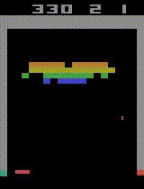
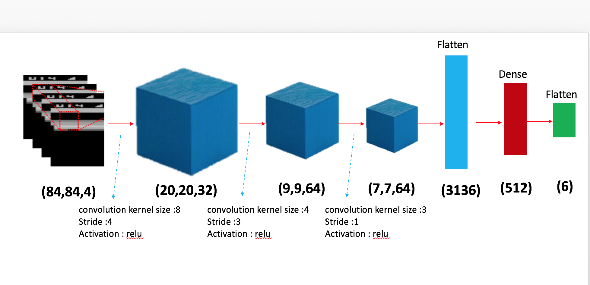

# Deep-Q-Network--Breakout
This is the third assignment of ADLxMLDS course, NTU 2017 Fall, which is an implementation of Deep Q Learning (DQN) 
playing Breakout from OpenAI's gym with Keras.

## Demo

 

I've implement deep reinforcement learning algorithm with Keras. 
In this project, the following techniques have been implemented:

- [x] Deep Q Learning
- [x] Double Q Learning
- [x] Dueling Network
- [ ] Prioritized Experience Play 

Here's the architecture overview of DQN model in this work:

 

The project is derived from an assignment of the course [ADLxMLDS](https://www.csie.ntu.edu.tw/~yvchen/f106-adl/) 2017 fall.

## Requirements

The follow packages are required, you can install them with `pip3 install [package]`

- opencv-python
- gym
- gym[atari]
- tensorflow
- keras
- scipy

## Setup
- Training an agent to play atari game
	
    To train an agent playing Breakout with DQN, simply run

	`python main.py --train_dqn`
    
    To activate advanced algorithm such as Double DQN (DDQN)/ Dueling Network, you can run
    
    `python main.py --train_dqn --ddqn True`
    
    `python main.py --train_dqn --dueling True`

- Test the agent's ability

     Before test the code, download the pretrained model from [google drive](https://drive.google.com/open?id=1bEExnpqm13gBggtCld_aMBxBdbr1ze-s), and put the model into `./pretrained_model/model.h5`
     
     By running the following command, you can get agent's average score in 100 episode
     
     `python test.py --test_dqn`
     
     Testing can be performed with the pretrained model training by default or with the model you trained by adding argument `--test_dqn_model_path [your model path]`
     
     To visualize the gaming progress, add `--do_render` to the end. You can also save it to vedio with `--video_dir [path to save]` (set smaller testing episode before doing so)

     `python test.py --test_dqn --do_render`

     or 
      
    `python test.py --test_dqn --video_dir [path]`

## References
- [DQN in Keras + TensorFlow + OpenAI Gym by tokb23](https://github.com/tokb23/dqn)
- [A tutorial of Prioritized Experience Replay by morvanzhou](https://morvanzhou.github.io/tutorials/machine-learning/reinforcement-learning/4-6-prioritized-replay/)
- [DQN-DDQN-on-Space-Invaders by yilundu](https://github.com/yilundu/DQN-DDQN-on-Space-Invaders) 
- Framework provided by TAs of the course.
